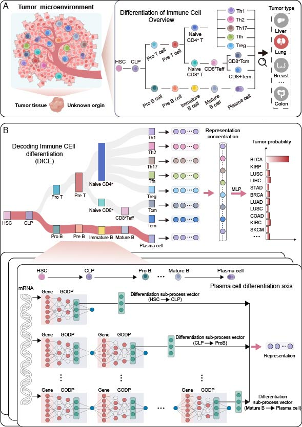

# DICE
[](https://github.com/zhaopapers/DICE)
[](https://www.repostatus.org/#active)
[](https://www.gnu.org/licenses/old-licenses/gpl-2.0.en.html)


DICE: Decoding Immune Cell Differentiation for Tumor-Type Prediction and Mechanism Interpretation

## Introduction

`DICE` can combine prior knowledge of immune cell differentiation with biological processes to construct a biologically neural network model for tumor type prediction. Moreover, it conducts an introspective analysis of the model, thereby identifying key immune cell differentiation processes, biological processes and genes across different cancer types. 



## A notice on operating system compatibility
- We recommend using as input the gene expression matrix normalized by log2(fpkm+0.001).


## Environment set up
Installing Anaconda, you can create a virtual environment named DICE and install the required packages based on the environment.yml file using the following command:
``` Python (version 3.10.9)
``` Anaconda
conda env create -f environment.yml
```
To clone our model, install github and run:
``` 
git clone https://github.com/zhaopapers/DICE.git
```


## Usage

### Construction of GODP learning module 
#### Usage for GODP.ipynb
The GODP.ipynb notebook serves as the main entry point for training the Gene Ontology Biological Process(GODP) learning module. 
#### Network Construction
```
network = Network(
    input_data==input_data,
    pathways==pathways,
    mapping==translation,
    input_data_column="Gene",  # Column name in your data matrix identifying features
    source_column="source",    # Column name in pathway file for source nodes
    target_column="target"     # Column name in pathway file for target nodes
)
```

#### Training & Validation
The training process is handled by the based_cell_train wrapper, which performs Stratified K-Fold cross-validation and SHAP-based feature importance calculation.
To start training, execute the relevant cell in the notebook:
```
binn = BINN(
    network=network,
    activation = "tanh",
    activation_final = "sigmoid",
    n_layers=4,
    dropout=0.2,
    validate=False,
    device="cuda",
    learning_rate=0.001,
)
explainer = BINNExplainer(binn)
trainer = based_cell_train(binn, explainer)
df, return_dict = trainer.fit(
    input_data=test_input_data,
    design_matrix=test_input_sign,
    nr_iterations=10,      # Number of total training iterations
    n_folds=3,             # Number of folds for Cross-Validation
    max_epochs=100,        # Maximum training epochs per fold
    batch_size=16,         # Batch size
    num_workers=20,        # Number of CPU workers for data loading
    dir="./models/"        # Directory to save model checkpoints (.pth) and variables
)
```

#### Model Hyperparameters

`-test_input_data:` is a gene Expression Matrix, which here refers to single-cell data with genes as rows and cells as columns. Supports (e.g., HSC, B-cell, or T-cell differentiation stages) single-cell RNA-seq data.

`-test_input_sign:` is a CSV file providing the metadata for each cell. Must include a sample column (matching test_input_data columns) and a group column representing cell types.

`-n_layers` is the number of hidden layers (biological hierarchy levels) to use, with a default value of 4; 

`-activation` is the activation function for hidden layers with a default value of "tanh"; 

`-activation_final` is the activation function for the final classification layer/residual blocks with a default value of "sigmoid"; 

`-dropout` is the dropout rate to prevent overfitting, with a default value of 0.2; 

`-learning_rate` is the initial learning rate for the Adam optimizer with a default value of 0.001; 

`-device` is the compute device ("cpu" or "cuda") with a default value of "cuda";

`-nr_iterations` is the number of training repetitions to perform to ensure robustness, with a default value of 10);

`-max_epochs` is the maximum number of training epochs per fold, with a default value of 100;

`-batch_size` is the number of samples per batch during training, with a default value of 16;

`-n_folds` is the number of cross-validation folds to use, with a default value of 3;

`-num_workers` is the number of CPU subprocesses used for data loading, with a default value of 20;

`-dir` is the directory path where the model checkpoints (.pth) and interpretation files (.pkl) will be saved.

### Construction of DICE  
#### Usage for main.ipynb
The main.ipynb notebook is designed for constructing the DICE model, evaluating the model.
```
binn = BINN(
    activation = "tanh",
    activation_final = "sigmoid",
    connectivity_matrices_list = data,
    dropout=0.2,
    validate=False,
    device="cuda:0",
    learning_rate=0.001,
)

trainer = DICE(binn)
return_dict= trainer.fit(test_input_data,
                        test_input_sign,
                        nr_iterations=1,
                        temperature_init=1.0,
                        connectivity_matrices_list = data,
                        batch_size=32,
                        n_folds=3,
                        val_size = 0.2,
                        test_size = 0.2,
                        max_epochs=100,
                        num_workers=0,
                        gene_list=gene_list)
```
#### Model Hyperparameters

`-test_input_data:` is a gene Expression Matrix, which here refers to bulk-tissue data with genes as rows and samples as columns. Supports bulk tissue data (e.g., TCGA Pan-cancer cohorts).

`-test_input_sign:` is a CSV file providing the metadata for each sample. Must include a sample column (matching test_input_data columns) and a group column (numeric labels, e.g., 1–24) representing tumor classes.

`-activation` is the activation function for hidden layers with a default value of "tanh"; 

`-activation_final` is the activation function for the final classification layer/residual blocks with a default value of "sigmoid"; 

`-dropout` is the dropout rate to prevent overfitting, with a default value of 0.2; 

`-learning_rate` is the initial learning rate for the Adam optimizer with a default value of 0.001; 

`-device` is the compute device ("cpu" or "cuda") with a default value of "cuda";

`-nr_iterations` is the number of complete training cycles to run, with a default value of 1;

`-max_epochs` is the maximum number of training epochs per fold, with a default value of 100;

`-batch_size` is the number of samples processed before the model is updated, with a default value of 32;

`-n_folds` is the number of folds for Stratified Shuffle Split cross-validation, with a default value of 3;

`-val_size` is the proportion of data reserved for validation, with a default value of 0.15;

`-test_size` is the proportion of data reserved for testing, with a default value of 0.15;

`-temperature_init` is the initial value for temperature scaling used in probability calibration with a default value of 1.0;

`-num_workers` is the number of CPU subprocesses to use for data loading, with a default value of 0;

`-connectivity_matrices_list` is the dictionary containing sparse matrices that define the biological network topology;

`-gene_list` is the list of genes used to filter the input data to ensure intersection with the network features.

### Model Interpretation
#### Usage for explain.ipynb
The explain.ipynb notebook implements model interpretability analysis by calculating SHAP (SHapley Additive exPlanations) values to quantify feature importance.
```
Calculate the MEAN SHAP values across the tumor class (Group-level resolution).
shap = SHAPExplainer(
            input_data=test_input_data, 
            design_matrix=test_input_sign, 
            model=model,
            device="cuda:0"
        )

shap.explain_cell(
            output_dir="/model", 
            iteration=0

        )

shap = SHAPExplainer(
            input_data=test_input_data, 
            design_matrix=test_input_sign, 
            model=model,
            device="cuda:1"
        )

shap.explain(
            output_dir="/model", 
            iteration=0
   
        )
```


```
Calculate SHAP values for EACH individual sample (Sample-level resolution).
shap_dict = explainer._explain_cell_layer(
            test_data, y, background_data
            )
df_GO = explainer.shap_single_G0(shap_dict,y,connectivity_matrices_list,target_key)
df_cell = explainer.shap_single_cell(shap_dict,y)  


```
#### Model Hyperparameters

`-model` is the trained DICE model object loaded from a saved checkpoint (e.g., .pth file);

`-output_dir` is the directory path where the resulting SHAP explanation CSV files (e.g., shap_cell_iter0.csv) will be saved;

`-iteration` is an integer index used to suffix the output filenames to track different explanation runs with a default value of 0;

`-target_key` is the specific pathway or gene to focus on when generating single cell differentiation process explanations (e.g., "Teff_CD8_cell_Tcm_layers");

`-background_data` is the reference dataset (tensor) derived from training data, used by the SHAP DeepExplainer as the background distribution;

`-test_data` is the target dataset (tensor) for which SHAP values are calculated to explain the model's predictions. 

### Files
| File                              | Description                                                                   |
|------------------------------------|------------------------------------------------------------------------|
| GODP/binn.py                             | Defines the core architecture of the BINN model based on PyTorch Lightning, responsible for dynamically constructing hierarchical neural networks according to biological pathway topologies.                            |
| GODP/network.py                          | Responsible for building biologically directed graphs and converting the mapping relationships between pathways and genes into connection matrices required between layers of the neural network. |
| GODP/based_cell_train.py                            | Encapsulates the complete training workflow, responsible for executing stratified K-fold cross-validation, model fitting, and calling SHAP for interpretability analysis.                              |
| GODP/explainer.py                            | SHAP for interpretability analysis for GODP                              |
| GODP/util_for_examples.py  | Provides auxiliary tools for data preprocessing, mainly used to align gene expression matrices with network input features and generate standardized training data.                                       |
| binn.py                          | The core implementation of the biological information neural network (BINN) is built using PyTorch Lightning, integrating prior knowledge of cell differentiation processes and biological pathway topological structures to form a hierarchical network architecture. |
| DICE.py                            |The DICE model's main program integrates various functional modules to drive a complete tumor classification workflow.                              |
| explain.py  | The SHAP interpreter implements the SHAPExplainer class, supporting the calculation of SHAP values ​​for multi-class samples and cross-sample aggregation analysis.                                       |
| explainer.py  | The base class for model explanation provides the basic framework for BINNExplainer, including weight initialization and the core logic for hierarchical feature importance calculation.                                       |

### Data


`Gene_and_network.pkl` A serialized .pkl file (e.g., Gene_and_network.pkl) containing a list of genes used as input for the model, and connectivity matrices for different cell types generated based on GODP.

`Benchmark.csv:`A comprehensive log of model performance across iterations, including metrics such as ACC, F1, recall macro_precision, and specific dataset accuracies (e.g., ICGC, TCGA).

`Supplementary Table.xlsx`The datasets used in this study cover fundamental immune cell differentiation processes and a comprehensive pan-cancer landscape.


